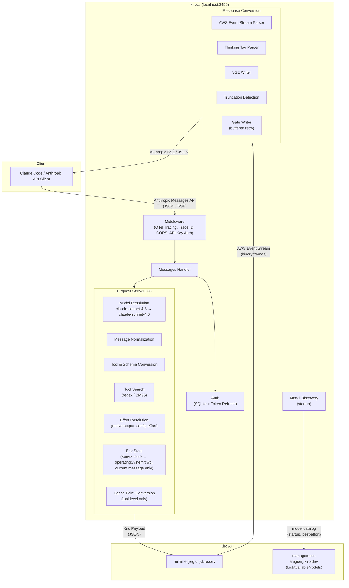

# kirocc

A local proxy server that relays Anthropic Messages API-compatible requests to the Kiro (Amazon Q) backend using Kiro CLI credentials.

Just set `ANTHROPIC_BASE_URL` from any Anthropic API client (e.g., Claude Code) to use Claude models via Kiro.

## Features

- **Anthropic Messages API compatible** — Supports `/v1/messages` (streaming / non-streaming), `/v1/messages/count_tokens`, and `/v1/models`
- **Request conversion** — Automatically converts Anthropic API requests to Kiro API (AWS Event Stream) format
- **Response conversion** — Converts Kiro event streams back to Anthropic SSE format
- **Automatic auth management** — Reads credentials from Kiro CLI's SQLite DB with automatic token refresh (Social / OIDC)
- **Kiro API key authentication** — Alternatively authenticate with a `KIRO_API_KEY` (`ksk_…`) for headless environments (CI, containers) where an interactive Kiro login is not available
- **Model mapping** — Maps Anthropic model names (e.g., `claude-sonnet-4-6`) to Kiro model names. Customizable via environment variable
- **Automatic model discovery** — Fetches Kiro's model catalog (`ListAvailableModels`) at startup, so models Kiro launches after a kirocc release resolve with the right context window and effort levels without a code change. Built-in mappings always win; discovery only fills gaps
- **Custom API region** — Pin the region in `runtime.<region>.kiro.dev` with `-kiro-api-region`, for accounts whose stored credential region is not one Kiro serves
- **Extended Thinking** — Enable via the `[1m]` suffix, the `thinking` field, or `output_config.effort`. Reasoning depth travels natively as `additionalModelRequestFields.output_config.effort` (validated against each model's enum; defaults to `medium` for effort-capable models when thinking is on without an explicit effort)
- **Tool Search** — Proxy-side implementation of Anthropic's [Tool Search Tool](https://platform.claude.com/docs/en/agents-and-tools/tool-use/tool-search-tool). Supports `tool_search_tool_regex_20251119` and `tool_search_tool_bm25_20251119` with `defer_loading` for on-demand tool discovery
- **Web Search** — Proxy-side implementation of Anthropic's WebSearch server tool, backed by the Kiro-hosted `web_search`. Parallel multi-query fan-out, result pages fetched and attached as content, searches rendered natively in Claude Code and persisted across turns
- **Prompt Caching** — Converts Anthropic tool-level `cache_control` to Kiro `cachePoint`
- **Truncation detection** — Automatically injects a notice into the next request when a response is truncated
- **Retry** — Exponential backoff retry for 403 (token expiry), 429, and 5xx errors. Also retries responses the user would see as empty: thinking-only ones, and ones whose entire text is the synthetic role-alternation placeholder echoed back
- **API key auth** — Optional access restriction for the proxy itself
- **CORS** — Allows requests from localhost origins
- **File logging** — Write structured logs (OTel JSON Lines) to a rotating file via [lumberjack](https://github.com/natefinch/lumberjack). Defaults optimized for coding agent consumption (10 MB, uncompressed)
- **OpenTelemetry tracing** — Opt-in distributed tracing via `--otel` with OTLP HTTP exporter. Captures request/response headers and body as span events across the full proxy chain

## Prerequisites

- Go 1.26+
- One of the following:
  - [Kiro CLI](https://kiro.dev) installed and logged in, **or**
  - A Kiro API key (`KIRO_API_KEY`) — available for [Kiro Pro, Pro+, Pro Max, and Power](https://kiro.dev/docs/cli/authentication/) subscribers

## Installation

### Homebrew

```bash
brew install d-kuro/tap/kirocc
```

### go install

```bash
go install github.com/d-kuro/kirocc/cmd/kirocc@latest
```

## Usage

### Start the server

```bash
kirocc
```

Listens on `http://127.0.0.1:3456` by default.

### Use with Claude Code

```bash
export ANTHROPIC_BASE_URL=http://127.0.0.1:3456
export ANTHROPIC_AUTH_TOKEN=dummy
export CLAUDE_CODE_ENABLE_GATEWAY_MODEL_DISCOVERY=1   # optional: adds kirocc's models to the /model picker
claude
```

`ANTHROPIC_AUTH_TOKEN` is required by Claude Code but not used for authentication by kirocc (credentials are read from Kiro CLI's DB). Any non-empty value works unless `-api-key` is set.

`CLAUDE_CODE_ENABLE_GATEWAY_MODEL_DISCOVERY=1` makes Claude Code 2.1.129+
query kirocc's `GET /v1/models?limit=1000` endpoint at startup. Models returned
by Kiro, including newly discovered Claude models, then appear in `/model` as
`From gateway` entries — including the GPT 5.6 models via their
`claude-gpt-5.6-*` aliases (see [Model picker integration](#model-picker-integration-discovery-aliases)).

### Use with a Kiro API key

For headless environments (CI, containers, remote machines) where an interactive Kiro login is not available, you can authenticate with a [Kiro API key](https://kiro.dev/docs/cli/authentication/) instead:

```bash
export KIRO_API_KEY=ksk_...          # your Kiro API key
kirocc                               # no Kiro CLI login or database needed
```

When `KIRO_API_KEY` is set:

- The SQLite credential database is **never opened** — kirocc does not need Kiro CLI installed
- No token refresh occurs — the key is presented directly to the Kiro API
- A revoked key surfaces as a 401 from the API at request time
- An empty or unset key falls back to the credential database as before

Optionally set `KIRO_API_REGION` (default: `us-east-1`) if your Kiro account is in a different region.

Then use with Claude Code as usual:

```bash
export ANTHROPIC_BASE_URL=http://127.0.0.1:3456
export ANTHROPIC_AUTH_TOKEN=dummy
claude
```

API keys are available for Kiro Pro, Pro+, Pro Max, and Power subscribers. On group subscriptions, an administrator must enable key generation in _Settings → Kiro settings → Enable users to generate API keys_. Create keys at [app.kiro.dev](https://app.kiro.dev) → API Keys.

### Run as a background service (macOS)

To keep kirocc running across logins without a dedicated terminal, install it as
a launchd user agent. From a clone of this repository:

```bash
make service-install              # build, install, start
make service-install SHELL_ENV=1  # also add the Claude Code env to your shell rc
```

Then just run `claude`. The agent starts at login and is restarted by launchd if
it exits.

| Command                  | Description                                       |
| ------------------------ | ------------------------------------------------- |
| `make service-install`   | Build, install the agent, and start it            |
| `make service-uninstall` | Stop and remove the agent                        |
| `make service-restart`   | Restart the running agent                        |
| `make service-status`    | Show agent state and whether the port answers    |
| `make service-logs`      | Tail the kirocc log                              |

What the installer touches:

| Path                                              | Purpose                    |
| ------------------------------------------------- | -------------------------- |
| `~/.local/bin/kirocc`                             | Built binary               |
| `~/Library/LaunchAgents/com.kirocc.server.plist`  | launchd agent definition   |
| `~/Library/Logs/kirocc/kirocc.log`                | Rotating kirocc log        |
| `~/Library/Logs/kirocc/launchd.log`               | launchd-level startup errors |

Set `KIROCC_PORT` before installing to use a different port. The port is baked
into the generated plist, so re-run `make service-install` after changing it.

`ANTHROPIC_BASE_URL` and `ANTHROPIC_AUTH_TOKEN` are read by the `claude` client,
not by the kirocc server, so they cannot be supplied through the launchd agent.
They have to be exported in the shell that runs `claude` — that is what
`SHELL_ENV=1` automates.

On Linux, use a systemd user unit instead:

```ini
# ~/.config/systemd/user/kirocc.service
[Unit]
Description=kirocc (Claude Code proxy)

[Service]
ExecStart=%h/.local/bin/kirocc -port 3456
Restart=always
RestartSec=10

[Install]
WantedBy=default.target
```

```bash
systemctl --user enable --now kirocc
```

### Command-line options

| Flag                       | Default                   | Description                                                               |
| -------------------------- | ------------------------- | ------------------------------------------------------------------------- |
| `-port`                    | `3456`                    | Listen port                                                               |
| `-host`                    | `127.0.0.1`               | Bind host                                                                 |
| `-db`                      | (OS-dependent, see below) | Kiro CLI SQLite DB path                                                   |
| `-api-key`                 | (none)                    | API key required to access the proxy                                      |
| `-kiro-api-key`            | (none)                    | Kiro API key (`ksk_…`) for upstream authentication                        |
| `-region`                  | (from credentials)        | Override the Kiro API region                                              |
| `-kiro-api-region`         | (from credentials)        | Alias for `-region`                                                       |
| `-base-url`                | (from region)             | Override the Kiro runtime endpoint entirely                               |
| `-model-discovery`         | `true`                    | Fetch Kiro's model catalog at startup                                     |
| `-max-body-size`           | `134217728`               | Max accepted client request body in bytes (0 = unlimited)                 |
| `-history-image-turns`     | `2`                       | Earlier user turns that replay their images on the current message        |
| `-web-search`              | `true`                    | Resolve Claude WebSearch through Kiro's hosted web search (see below)     |
| `-web-search-fetch`        | `3`                       | Top result pages downloaded per query, their text attached to results (0 = snippets only) |
| `-web-search-fetch-bytes`  | `6144`                    | Max bytes of attached page text per fetched result                        |
| `-web-search-visible`      | `true`                    | Stream searches to the client as `server_tool_use`/`web_search_tool_result` blocks |
| `-debug`                   | `false`                   | Enable debug logging                                                      |
| `-log-file`                | (none)                    | Write logs to file with rotation (file-only by default)                   |
| `-log-max-size`            | `10`                      | Max log file size in MB before rotation                                   |
| `-log-max-backups`         | `5`                       | Max number of old log files to retain                                     |
| `-log-max-age`             | `7`                       | Max days to retain old log files                                          |
| `-log-compress`            | `false`                   | Compress rotated log files with gzip                                      |
| `-log-console`             | `false`                   | Also write logs to console when `-log-file` is set                        |
| `-otel`                    | `false`                   | Enable OpenTelemetry tracing (OTLP HTTP exporter)                         |
| `-otel-body-limit`         | `32768`                   | Max bytes of request body to capture in OTel spans (0 = unlimited)        |
| `-keepalive-interval`      | `15s`                     | SSE idle keep-alive interval (0 = disabled)                               |

#### Images

The Kiro request shape carries images only on the current message —
`conversationState.history` entries have no `images` field. Without help, an
image would therefore be visible on the turn it arrives and invisible on every
turn after, which is worse than it sounds: the model cannot tell the image is
gone, so a follow-up question ("what does that label say?") gets answered from
the previous reply alone.

Two adapter-side behaviours cover this:

- Images nested inside a `tool_result` — what Claude Code sends after `Read` on
  an image file — are lifted onto the message-level `images` array, since a Kiro
  tool result carries text or JSON only. A placeholder marks where they were.
- Images from an earlier turn are replayed on the current message for the next
  `-history-image-turns` user turns (default 2 — the current turn plus the two
  before it). The window counts turns rather than images so that a set attached
  together expires together: five images sent at once stay usable as a set for
  as long as a lone image would. This is also what makes a pasted image and a
  `Read` image usable together, since they arrive on different turns.

Replay puts an old image in exactly the place a freshly sent one would occupy, so
the current message's text gains a note saying how many of the leading images came
from earlier turns. Without it a screenshot from ten turns ago reads as part of
the current question, and the model has no way to tell otherwise — `images`
entries carry bytes and format and nothing else.

That note fixes the misreading but not the bill. Replay attaches to the current
message, which changes every turn, so the bytes are never prompt-cached: every
carried image is charged again on every turn, which is why the window is short
rather than generous. Once a turn falls outside it the `[image provided earlier in
this conversation]` placeholder stays in history, so the model still knows an image
was there and can ask for it again instead of guessing. Set it to `0` to disable
replay entirely (the upstream behaviour: earlier-turn images are dropped), or a
negative value for no limit.

Tool results arrive as user-role messages too, so they are not counted as turns —
a handful of `Read` calls cannot consume the window before you have said anything
else.

Images over 5 MB (measured on the base64 payload) are dropped with a placeholder
rather than sent. Probing the backend shows the limit is per-image, not
per-request — one 4.85 MiB image succeeds, one 5.24 MiB image fails, and four
images totalling 12.40 MiB succeed. Rejection surfaces as a bare
`upstream API error` 502 naming neither the image nor its size, and since replay
resends history images every turn, one oversized image would otherwise fail every
later turn in the session too.

#### Default DB path

| OS    | Path                                                  |
| ----- | ----------------------------------------------------- |
| macOS | `~/Library/Application Support/kiro-cli/data.sqlite3` |
| Linux | `~/.local/share/kiro-cli/data.sqlite3`                |

#### API region

Kiro completions use `https://runtime.<region>.kiro.dev/`, while automatic
model discovery uses `https://management.<region>.kiro.dev/`. The region is
resolved from the credential store, preferring the region encoded in the
CodeWhisperer profile ARN (`api.codewhisperer.profile`), then any stored region
field, then `us-east-1`.

The profile ARN region is preferred because it is the API region, which can
differ from the OIDC/SSO region for IDC users: an Identity Center instance in
`ap-northeast-2` may be issued a profile in `us-east-1`. Token refresh keeps
using the OIDC region independently of this setting.

Use `-region` (or its `-kiro-api-region` alias) when the resolved region is not
the one you need. `KIROCC_REGION` and `KIRO_API_REGION` are the corresponding
environment variables; `KIROCC_REGION` wins when both are set. Use `-base-url`
/ `KIROCC_BASE_URL` to bypass runtime URL construction entirely, which is useful
for putting a proxy in front of the upstream API.

### Environment variables

Command-line options can be overridden with environment variables.

| Variable                      | Corresponding option  |
| ----------------------------- | --------------------- |
| `KIROCC_PORT`                 | `-port`               |
| `KIROCC_HOST`                 | `-host`               |
| `KIROCC_DB_PATH`              | `-db`                 |
| `KIROCC_API_KEY`              | `-api-key`            |
| `KIRO_API_KEY`                | `-kiro-api-key`       |
| `KIROCC_REGION`               | `-region`             |
| `KIRO_API_REGION`             | `-kiro-api-region`    |
| `KIROCC_BASE_URL`             | `-base-url`           |
| `KIROCC_MODEL_DISCOVERY`      | `-model-discovery`    |
| `KIROCC_MAX_BODY_SIZE`        | `-max-body-size`      |
| `KIROCC_HISTORY_IMAGE_TURNS`  | `-history-image-turns`|
| `KIROCC_WEB_SEARCH`           | `-web-search`         |
| `KIROCC_WEB_SEARCH_FETCH`     | `-web-search-fetch`   |
| `KIROCC_WEB_SEARCH_FETCH_BYTES` | `-web-search-fetch-bytes` |
| `KIROCC_WEB_SEARCH_VISIBLE`   | `-web-search-visible` |
| `KIROCC_DEBUG`                | `-debug`              |
| `KIROCC_LOG_FILE`             | `-log-file`           |
| `KIROCC_LOG_MAX_SIZE`         | `-log-max-size`       |
| `KIROCC_LOG_MAX_BACKUPS`      | `-log-max-backups`    |
| `KIROCC_LOG_MAX_AGE`          | `-log-max-age`        |
| `KIROCC_LOG_COMPRESS`         | `-log-compress`       |
| `KIROCC_LOG_CONSOLE`          | `-log-console`        |
| `KIROCC_OTEL`                 | `-otel`               |
| `KIROCC_OTEL_BODY_LIMIT`      | `-otel-body-limit`    |
| `KIROCC_KEEPALIVE_INTERVAL`   | `-keepalive-interval` |

### Automatic model discovery

At startup kirocc calls Kiro's `ListAvailableModels` and installs the result as a fallback layer behind the built-in mapping table. A model Kiro launches after a kirocc release therefore resolves with its real context window and effort enum instead of falling back to pass-through defaults, and shows up in `GET /v1/models`.

Resolution order is `KIROCC_MODEL_MAPPINGS` → built-in table → discovered catalog, first match wins. Built-ins deliberately win: they encode behaviour a mechanically derived entry cannot reproduce, such as which `[1m]` aliases must *not* enable extended thinking and which SKU a 1M request routes to.

Discovery is best-effort and never blocks startup or fails a request. It is
skipped when the credential has no profile ARN, since the API requires one,
and any error leaves the built-in table in place:

```
WRN model discovery failed, using built-in model table region=ap-southeast-1 err="..."
```

Disable it with `-model-discovery=false`.

### OpenTelemetry tracing

Enable distributed tracing to visualize the full request chain in Jaeger, Grafana Tempo, or any OTLP-compatible backend.

```bash
# Start a local collector (e.g., Grafana LGTM stack)
docker run -d --name lgtm -p 3000:3000 -p 4317:4317 -p 4318:4318 grafana/otel-lgtm

# Start kirocc with tracing enabled
kirocc -otel
```

The OTLP endpoint defaults to `http://localhost:4318` and can be configured via the standard `OTEL_EXPORTER_OTLP_ENDPOINT` environment variable.

### Custom model mappings

Use the `KIROCC_MODEL_MAPPINGS` environment variable to override model name mappings.

```bash
export KIROCC_MODEL_MAPPINGS='[{"anthropic":"my-model","kiro":"claude-sonnet-4.5","context_window_size":200000}]'
```

## Endpoints

| Path                             | Description                              |
| -------------------------------- | ---------------------------------------- |
| `GET /health`                    | Health check                             |
| `GET /v1/models`                 | List available models                    |
| `POST /v1/messages`              | Messages API (streaming / non-streaming) |
| `POST /v1/messages/count_tokens` | Token count (approximate \*)             |

\* `count_tokens` uses the `cl100k_base` encoding from [tiktoken-go](https://github.com/pkoukk/tiktoken-go), which differs from Claude's actual tokenizer. The returned value is an approximation.

## Architecture



### Request flow

1. Client sends an Anthropic Messages API request to kirocc
2. Middleware assigns a trace ID, handles CORS, and validates the API key
3. Auth reads/refreshes credentials from Kiro CLI's SQLite DB
4. Handler resolves the model name and determines thinking mode
5. Request conversion pipeline:
   - Normalizes messages (merges consecutive same-role messages, extracts text/images/tool_use/tool_result from multi-block content)
   - Converts tools and sanitizes JSON Schema (removes unsupported keywords, flattens `anyOf`/`oneOf`/`allOf`)
   - If tool search tools are present, partitions tools into active/deferred and injects a proxy-side `ToolSearch` tool
   - Extracts system prompt and places it as a history entry pair
   - Parses the `<env>` block from the system prompt into `envState` (`operatingSystem`, `currentWorkingDirectory`) and attaches it to the current message only
   - Reorders tool results to match the preceding assistant's tool_use order
   - Forwards reasoning effort natively as `additionalModelRequestFields.output_config.effort` at the request root (sibling of `conversationState`); the resolved effort is validated/clamped per model
   - Converts Anthropic tool-level `cache_control` to Kiro `cachePoint`
6. Kiro API returns an AWS Event Stream (binary frames)
7. Response conversion pipeline:
   - Parses binary event stream frames
   - Converts cumulative text to incremental deltas
   - Intercepts `ToolSearch` tool_use calls, executes search, emits `server_tool_use`/`tool_search_tool_result` SSE events, and re-requests Kiro with discovered tools (up to 3 rounds)
   - Parses `<thinking>` tags from `assistantResponseEvent` or uses `reasoningContentEvent` (with deduplication)
   - Enforces `stop_sequences` and `max_tokens` adapter-side
   - Detects truncated responses and stores them; a notice is injected into the next request
   - Gate Writer buffers output until visible content arrives, enabling transparent retry of empty-visible responses (thinking-only, or a bare synthetic-placeholder echo)

### Extended Thinking

kiro-cli 2.10.0 expresses reasoning depth natively through `output_config.effort`. kirocc forwards it as `additionalModelRequestFields.output_config.effort` at the request root (sibling of `conversationState`):

```json
{
  "conversationState": { "...": "..." },
  "additionalModelRequestFields": {
    "output_config": { "effort": "medium" }
  }
}
```

Thinking is enabled by any of:

- Model name with `[1m]` suffix (e.g., `claude-sonnet-4-6[1m]`)
- `Anthropic-Beta` header containing `context-1m` (e.g., `context-1m-2025-01-01`)
- `thinking.type` set to `"enabled"` or `"adaptive"` in the request

Exception: the `[1m]` suffix on an **always-1M** model (`claude-opus-5[1m]` / `claude-opus-4-8[1m]` / `claude-opus-4-7[1m]` / `claude-opus-4-6[1m]` / `claude-sonnet-5[1m]`) is a first-class alias that only advertises the 1M context window — it does **not** enable thinking (see [Model mappings](#model-mappings)). Thinking on those models is still opt-in via the `context-1m` header or the `thinking` field.

The suffix is matched case-insensitively because Claude Code may emit `[1M]`
from internal call paths. Responses always use the canonical lowercase `[1m]`.

The reasoning effort sent to the backend is resolved as follows:

1. An explicit, recognized `output_config.effort` wins, validated/clamped to the model's allowed enum (`xhigh` on a 4-value model clamps to `max`; unrecognized strings are dropped).
2. Otherwise, if reasoning is enabled (via `thinking.type`, the `[1m]` suffix, or the `context-1m` header) without an explicit effort, a default effort of `medium` is sent so the intent reaches the backend.
3. Otherwise the field is omitted.

Per-model allowed effort levels:

- `claude-opus-5`, `claude-opus-4.8`, `claude-opus-4.7`, `claude-sonnet-5`: `low`, `medium`, `high`, `xhigh`, `max`
- `claude-opus-4.6`, `claude-sonnet-4.6` (and their `-1m` variants): `low`, `medium`, `high`, `max` (no `xhigh`; clamps to `max`)
- Models not listed here fall back to the enum advertised by [model discovery](#automatic-model-discovery), if any
- All other models omit `additionalModelRequestFields` entirely

`thinking.budget_tokens` is accepted in the request but no longer affects behavior; reasoning depth is conveyed entirely through `effort`.

#### GPT 5.6 models (reasoning schema)

The GPT 5.6 family (`gpt-5.6-sol`, `gpt-5.6-terra`, `gpt-5.6-luna`) uses a different `additionalModelRequestFields` schema — `reasoning.effort` instead of `output_config.effort`:

```json
{
  "conversationState": { "...": "..." },
  "additionalModelRequestFields": {
    "reasoning": { "effort": "high" }
  }
}
```

GPT-specific effort rules:

- No `thinking` field and no explicit effort → the field is omitted entirely (the backend defaults to `high`, matching kiro-cli behavior)
- `thinking.type: "enabled"` / `"adaptive"` → still omitted (= backend default `high`); no downgrade to `medium`
- `thinking.type: "disabled"` → `reasoning.effort: "none"` (takes precedence over an explicit effort)
- Explicit `output_config.effort` → validated against the GPT enum (`none`, `low`, `medium`, `high`, `xhigh`, `max`) and forwarded as `reasoning.effort`

GPT reasoning streams as opaque `redacted_thinking` blocks (base64 blobs, no visible thinking text). The blob arrives **after** text/tool_use in the upstream stream and is surfaced to the client in that order. During tool-use continuations the client must send the `redacted_thinking` block back; kirocc replays it as `reasoningContent.redactedContent` in the request history only while that tool round is in flight.

The `[1m]` suffix and `context-1m` header are not supported for GPT models (`gpt-5.6-sol[1m]` does not resolve). Context window is 272k input / 128k output; limits are enforced by the backend, not the proxy.

#### Model picker integration (discovery aliases)

Claude Code's [gateway model discovery](https://code.claude.com/docs/en/llm-gateway-protocol) fetches `GET /v1/models` and adds the results to the `/model` picker — but it silently drops any ID that doesn't start with `claude` or `anthropic`, so the bare `gpt-5.6-*` IDs never appear. kirocc therefore also advertises `claude-` prefixed discovery aliases:

| Alias                  | Kiro model      | Picker label    |
| ---------------------- | --------------- | --------------- |
| `claude-gpt-5.6-sol`   | `gpt-5.6-sol`   | `GPT 5.6 Sol`   |
| `claude-gpt-5.6-terra` | `gpt-5.6-terra` | `GPT 5.6 Terra` |
| `claude-gpt-5.6-luna`  | `gpt-5.6-luna`  | `GPT 5.6 Luna`  |

The aliases resolve identically to the canonical IDs (same 272k window, same reasoning schema). To surface them in the picker, launch Claude Code with:

```bash
export ANTHROPIC_BASE_URL=http://127.0.0.1:3456
export ANTHROPIC_AUTH_TOKEN=dummy
export CLAUDE_CODE_ENABLE_GATEWAY_MODEL_DISCOVERY=1
claude
```

The picker shows them under "From gateway" using the `display_name` values above. The canonical `gpt-5.6-*` IDs still work everywhere else (`--model gpt-5.6-sol`, `ANTHROPIC_MODEL`, direct API calls).

### Tool Search

The Kiro backend does not support Anthropic's [Tool Search Tool](https://platform.claude.com/docs/en/agents-and-tools/tool-use/tool-search-tool). kirocc implements it proxy-side with an inner loop:

1. Client sends `tool_search_tool_regex_20251119` (or `bm25`) + tools with `defer_loading: true`
2. Proxy partitions tools into active (sent to Kiro) and deferred (held for search)
3. Proxy injects a `ToolSearch` tool definition that Kiro can understand
4. When the model calls `ToolSearch`, the proxy intercepts the tool_use:
   - Executes regex or BM25 search against deferred tools
   - Emits `server_tool_use` + `tool_search_tool_result` SSE events to the client
   - Promotes discovered tools to active and rebuilds the Kiro request
   - Calls Kiro again with the updated tool list (up to 3 rounds)
5. When the model calls a regular tool or produces text, the response is forwarded to the client

Supported query forms:

- `select:Read,Edit,Grep` — exact tool selection by name
- `read file` — keyword search (regex with word-level OR fallback, or BM25 scoring)

### Web Search

Anthropic's WebSearch is a server tool: the search runs inside Anthropic's API, which the Kiro backend cannot do. kirocc reproduces the whole pipeline proxy-side, using the `web_search` tool AWS hosts behind the Kiro subscription (same credentials, no extra API key):

1. The client's `web_search_20250305` declaration is swapped for the Kiro-hosted `web_search` tool. `max_uses` and `allowed_domains`/`blocked_domains` from the declaration are honored.
2. When the model requests a search, kirocc intercepts the tool_use. One call may fan out up to 5 queries (`query` + `additional_queries`), executed in parallel against the MCP endpoint.
3. Search results are **enriched**: the top `-web-search-fetch` result URLs are downloaded (SSRF-guarded, cached 15 min) and their readable text is attached per result, so the model answers from page content rather than snippets — the substance native WebSearch provides.
4. In visible mode (default), each search is emitted to the client as `server_tool_use` + `web_search_tool_result` blocks — Anthropic's native shape — so Claude Code renders the search and replays the results on later requests. Fetched page text travels in the `encrypted_content` field, which clients round-trip verbatim; kirocc decodes it back into history on replay, making past search results part of the model's memory in later turns.
5. Budgets: at most 3 extra Kiro round-trips and 10 queries per client request (lowered by `max_uses`). A failed search returns as a tool error the model can react to, never as a failed request.

`-web-search=false` disables the replacement entirely (the declaration is still stripped, since Kiro rejects schema-less tools).

### Model mappings

| Input model             | Kiro model             | Context window |
| ----------------------- | ---------------------- | -------------- |
| `claude-opus-5`         | `claude-opus-5`        | 1M             |
| `claude-opus-5[1m]`     | `claude-opus-5`        | 1M             |
| `claude-sonnet-5`       | `claude-sonnet-5`      | 1M             |
| `claude-sonnet-5[1m]`   | `claude-sonnet-5`      | 1M             |
| `claude-sonnet-4-6`     | `claude-sonnet-4.6`    | 200k           |
| `claude-sonnet-4-6[1m]` | `claude-sonnet-4.6-1m` | 1M             |
| `claude-sonnet-4.5`     | `claude-sonnet-4.5`    | 200k           |
| `claude-sonnet-4.5[1m]` | `claude-sonnet-4.5-1m` | 1M             |
| `claude-opus-4-8`       | `claude-opus-4.8`      | 1M             |
| `claude-opus-4-8[1m]`   | `claude-opus-4.8`      | 1M             |
| `claude-opus-4-7`       | `claude-opus-4.7`      | 1M             |
| `claude-opus-4-7[1m]`   | `claude-opus-4.7`      | 1M             |
| `claude-opus-4-6`       | `claude-opus-4.6`      | 1M             |
| `claude-opus-4-6[1m]`   | `claude-opus-4.6`      | 1M             |
| `claude-opus-4.5`       | `claude-opus-4.5`      | 200k           |
| `claude-haiku-4.5`      | `claude-haiku-4.5`     | 200k           |
| `gpt-5.6-sol`           | `gpt-5.6-sol`          | 272k           |
| `gpt-5.6-terra`         | `gpt-5.6-terra`        | 272k           |
| `gpt-5.6-luna`          | `gpt-5.6-luna`         | 272k           |
| `claude-gpt-5.6-sol`    | `gpt-5.6-sol`          | 272k           |
| `claude-gpt-5.6-terra`  | `gpt-5.6-terra`        | 272k           |
| `claude-gpt-5.6-luna`   | `gpt-5.6-luna`         | 272k           |

Opus 5, Opus 4.6, 4.7, 4.8, and Sonnet 5 always use 1M context (no 200k SKU exists upstream). Unlike Sonnet 4.6, `claude-opus-5` and `claude-sonnet-5` have no separate `-1m` SKU: each single SKU is always 1M. The explicit `[1m]`-suffixed aliases (`claude-opus-5[1m]` / `claude-opus-4-8[1m]` / `claude-opus-4-7[1m]` / `claude-opus-4-6[1m]` / `claude-sonnet-5[1m]`) are first-class entries that preserve the suffix verbatim in the response `model` field — this matches Claude Code's default Max-plan state (`lG()` emits `claude-opus-4-8[1m]`) and keeps its `mR()` 1M-context check happy without spuriously enabling extended thinking. On these always-1M models, thinking remains opt-in via the `context-1m` header or the `thinking` field; the `[1m]` suffix remains a thinking opt-in for models without a first-class always-1M alias.

Unmatched `claude-*` models are passed through as-is. Non-claude models fall back to `claude-sonnet-4.6` (the `gpt-5.6-*` IDs and their `claude-gpt-5.6-*` discovery aliases above are explicit entries and do not fall back).

#### Response model ID

The `model` field in `/v1/messages` responses (streaming `message_start`, non-streaming body, and tool-search path) is returned as the **Anthropic-form ID** (e.g. `claude-opus-4-7`), not the Kiro SKU (`claude-opus-4.7`).

When the proxy routes to a **1M context window** (always-1M SKU such as `claude-opus-5` / `claude-opus-4.8` / `claude-opus-4.7` / `claude-opus-4.6`, or a model invoked with the `[1m]` suffix or `Anthropic-Beta: context-1m` header), a trailing `[1m]` is appended to the response model ID (e.g. `claude-opus-5[1m]`). Claude Code's client-side context-window logic matches `/\[1m\]/i` on the response model to pick the 1M window — without the suffix it defaults to 200k and auto-compacts at ~160k even when upstream actually has 1M of context.

Note: `[1m]` has different meanings on request vs. response. On the **request** `model` it is a client-supplied thinking-opt-in signal (and is stripped before upstream routing). On the **response** `model` it is purely a context-window advertisement for Claude Code and does not imply that extended thinking was enabled.

## License

Apache License 2.0
